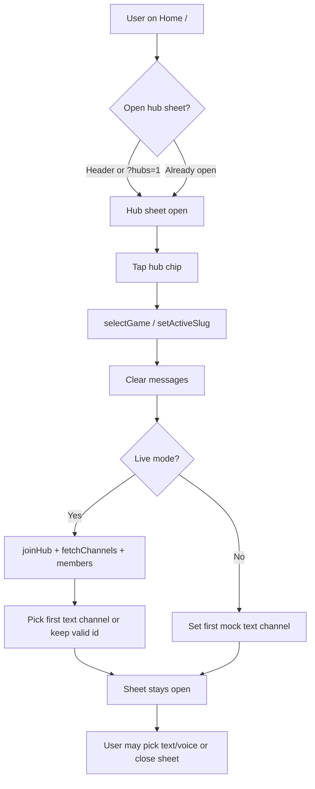
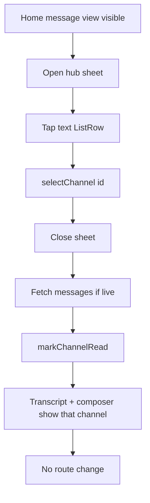
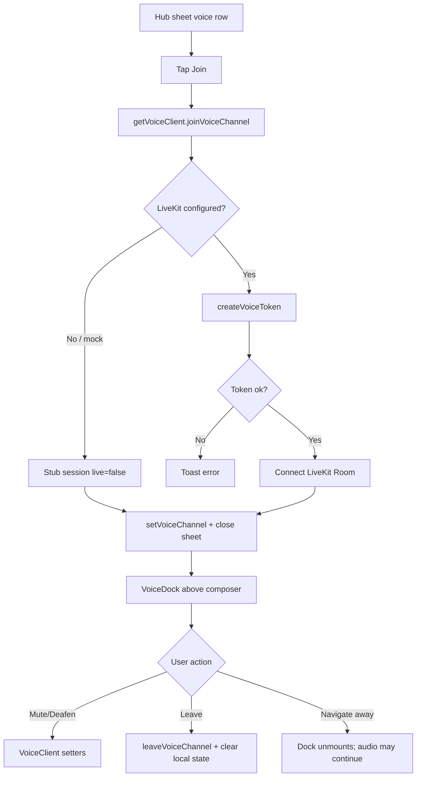
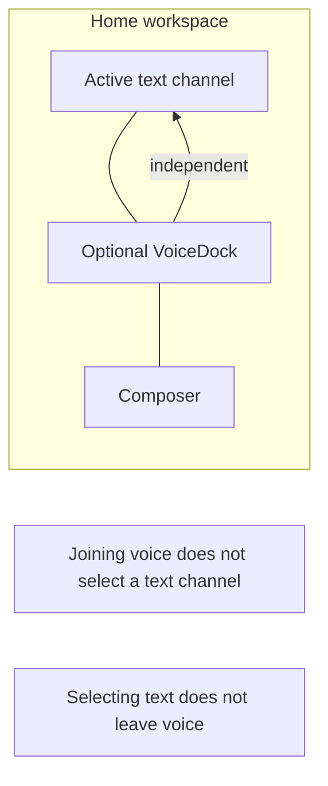
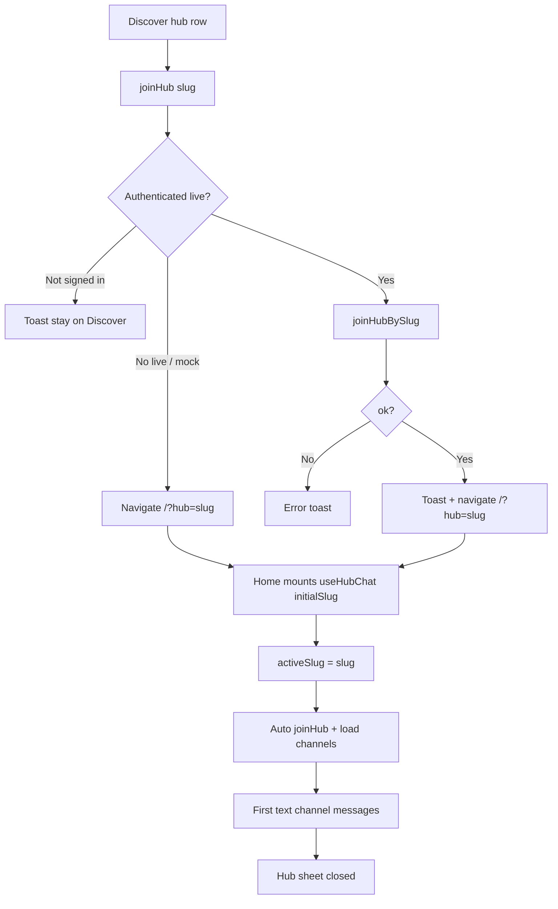

# Current Community, Channel, Text Chat, and Voice Flow

> **Superseded for product IA:** See [`docs/COMMUNITY-GAME-HOME-IA.md`](./COMMUNITY-GAME-HOME-IA.md) for the implemented Game Home stack (My Communities → Game Home → Chat). This document describes the **legacy** sheet-first Home behavior before that redesign.

**Purpose:** Document how community hubs, text channels, and voice channels worked in the codebase prior to the Game Home IA (for historical review).

**Scope:** Exact current behavior only. No redesign proposals. No code changes implied by this document.

**Primary surfaces:** Home (`/`), Discover (`/discover`), hub sheet, and (for contrast) DM voice (`/dm`).

**As of:** Documented against the implementation in `src/routes/index.tsx`, `src/hooks/use-hub-chat.ts`, `src/lib/chat/api.ts`, and `src/lib/voice/*`.

---

## 1. Community / Hub Entry Flow

### How a user opens a hub

| Entry point | What happens |
|-------------|--------------|
| **Home tab** | Bottom dock navigates to `/`. The user lands on the Home chat workspace for whatever hub is currently active in React state (or the default / URL-seeded hub). |
| **Home header hub control** | Tapping the hub name / icon / chevron opens the hub sheet (`hubSheetOpen`). Does not change hub by itself. |
| **Deep link `/?hub=<slug>`** | Search param is validated and passed into `useHubChat({ initialSlug })`. That slug becomes (or seeds) `activeSlug`. |
| **Deep link `/?hubs=1`** | Opens the hub sheet once, then clears `hubs` from the URL with `replace: true`. |
| **Discover join/open** | Calls join API (live), then navigates to `/?hub=<slug>`. |
| **Command palette** | Hub items navigate to `/?hub=<slug>`. |
| **Profile / Me hub tiles** | Links to `/` with `search={{ hub: slug }}`. |

Home is behind `AppShell` → `RequireAuth`. In live mode, unauthenticated users are sent to `/login`.

### How a user switches between hubs

1. User opens the hub sheet from the Home header (or via `/?hubs=1`).
2. Horizontal reorderable hub chips appear at the top of the sheet (`orderedGames`).
3. Tapping a chip calls `selectGame(id)` → `useHubChat.selectGame(slug)`.
4. Live mode: `activeSlug` updates; messages clear; `activeChannelId` clears; an effect then joins the hub, fetches channels/members, and selects the first text channel (or keeps the previous id if it still exists in the new hub).
5. Mock mode: sets the first mock text channel for that hub immediately.

**Important:** Selecting a hub chip does **not** close the sheet. The sheet closes when the user selects a text channel, joins voice, or follows “Find hubs” to Discover.

**Important:** Selecting a hub inside the sheet does **not** write `?hub=` to the URL. Only external navigations (Discover, command palette, profile links, etc.) set `?hub=`.

Hub chip **order** is persisted via `getHubOrder` / `setHubOrder` (`localStorage` key `nexus.pref.hubOrder`) and optionally synced to auth prefs `hub_order`.

### What screen appears first

There is no separate hub lobby page.

After opening Home (with or without `?hub=`), the user always sees the **Home chat workspace**:

- Header (hub + active text channel name)
- Optional topic strip / LFG board / search banner
- Message list for the active text channel
- Composer
- Optional `VoiceDock` if local voice state says the user is connected

Channels are discovered inside the hub sheet overlay, not as a first full-screen list.

### How the active hub is stored

| Store | Role |
|-------|------|
| URL `?hub=<slug>` | Seed / deep link only. Not kept in sync when switching hubs inside the sheet. |
| URL `?hubs=1` | One-shot “open hub sheet,” then removed. |
| React state `activeSlug` in `useHubChat` | **Source of truth** while Home is mounted. |
| `localStorage` / auth prefs | Hub **order** and hub notification modes — **not** the active hub. |
| Zustand / dedicated hub context | Not used for active hub. |

Default when no `?hub=`: `activeSlug` initializes to `"fortnite"`. After live hubs load, if that slug is missing, it falls back to `hubs[0].slug`. Invalid `?hub=` also falls back to the first hub silently (no toast, no auto-open sheet).

Leaving `/` unmounts `NexusApp` / `useHubChat`. Returning to `/` without `?hub=` re-initializes toward the default / first live hub.

### What happens when the user opens a hub from Discover

`CommunityRow` / game rows call `onOpen` → `joinHub(slug, hubName)` in `src/routes/discover.tsx`:

1. **Mock / unconfigured:** navigate to `/?hub=<slug>` (no membership API).
2. **Live, not signed in:** toast `toast.joinHubSignIn`; stay on Discover.
3. **Live, signed in:** `joinHubBySlug(slug, user.id)`; on success toast + navigate to `/?hub=<slug>` with `hubs` cleared.
4. Hub sheet stays **closed** after this navigation (unless the user separately opens it).

### What happens after joining a hub

- Discover path: membership upsert via `joinHubBySlug`, then Home opens with that slug.
- Home path: whenever live `activeHub` changes and a user is present, `useHubChat` always calls `joinHub(activeHub.uuid, user.id)` (upsert into `hub_members`), then `fetchChannels` + `fetchHubMembers`, then picks a text channel.

So switching hubs on Home also ensures membership for that hub.

Home’s hub catalog comes from `fetchLiveHubs()` (all hubs), not joined-only `fetchUserHubs`.

### Relevant routes, query parameters, state, hooks, and components

| Piece | Location |
|-------|----------|
| Route `/` | `src/routes/index.tsx` — `Route`, `NexusApp`, `HomeSearch` |
| Search params | `hub?: string`, `hubs?: "1"` |
| Discover join | `src/routes/discover.tsx` — `joinHub` |
| Chat hook | `src/hooks/use-hub-chat.ts` — `useHubChat`, `selectGame`, `selectChannel` |
| Client API | `src/lib/chat/api.ts` — `fetchLiveHubs`, `joinHub`, `joinHubBySlug`, `fetchChannels`, … |
| Prefs / order | `src/lib/prefs.ts` — `getHubOrder`, `setHubOrder` |
| Dock | `src/components/bottom-dock.tsx` |
| Sheet chrome | `Sheet` in `src/components/app-shell.tsx` |
| Command palette | `src/components/command-palette.tsx` — `goHub` |
| Auth gate | `src/components/require-auth.tsx`, `src/components/app-shell.tsx` |

---

## 2. Channel Discovery Flow

### How users find text channels

Text channels appear only inside the **hub sheet** on Home:

1. Open hub sheet (header or `/?hubs=1`).
2. Section titled text (`t("home.text")`).
3. Optional LFG jump button if an LFG channel exists and is not active (`isLfgChannel` in `src/lib/lfg.ts`).
4. `ListRow` per item in `chat.textChannels`.

Data: live `fetchChannels(hubUuid)` reads `text_channels` ordered by `position`; mock uses `HUBS[slug].textChannels`.

Selecting a text channel: `chat.selectChannel(c.id)`, close sheet, clear search query / live search.

### How users find voice channels

Same hub sheet, section titled voice (`t("home.voice")`):

- `ListRow` per `chat.voiceChannels`
- Trailing Join button (`joinVoice`)
- Subtitle: “in voice” if local `voiceChannel` matches; else member count if `v.members.length > 0`; else empty copy

Voice selection does **not** change the active text channel.

### Presentation: sheet, page, drawer, list, or inline?

| Aspect | Reality |
|--------|---------|
| Channel list | **Bottom sheet** overlay (`AppShell.Sheet`), not a route |
| Message view | Always the main Home column under the sheet |
| Separate channel page | None |
| Sidebar / drawer | None for channels |
| Desktop dual-pane channel list | None on Home (DMs are different) |

### How categories are displayed

**Channel categories are not implemented.**

`text_channels` has `id`, `hub_id`, `slug`, `name`, `topic`, `position`, `created_at` — no category field. The hub sheet lists channels flat (with an optional LFG jump shortcut).

Game categories on Discover cards are unrelated to channel grouping.

### How unread counts are shown

| Surface | Behavior |
|---------|----------|
| Text channel row in hub sheet | Badge from `c.unread` |
| Initial load | RPC `hub_channel_unreads` inside `fetchChannels` |
| Live bumps | Hub-wide Realtime INSERT on `messages` in `useHubChat`; skips active channel and own messages; cap 99 |
| Clear on open | `markChannelRead` after loading messages; clears that channel’s unread; dispatches `nexus:unread-refresh` |
| Home dock badge | `useMessageUnreadTotals` → RPC `user_message_unread_totals` → `channelUnread` on Home tab |

Voice channels have no unread.

Hub notification modes (`all | mentions | mute` in prefs / settings) are stored but **not** applied to Home channel unread UI in `useHubChat`.

### Hidden, locked, muted, or restricted channels

**Not implemented** in schema or Home UI.

- No hidden / locked / private / min-role columns on `text_channels`.
- Access is membership-gated by RLS (`is_hub_member`).
- `ListRow` prop `muted={!active && !c.unread}` is **visual dimming only**, not channel mute.
- Settings hub “mute” does not hide channels or suppress Home badges in chat code.

### How users return from a channel to the channel list

There is no full-screen channel list under the messages.

To see channels again, the user reopens the hub sheet from the header (or empty-state CTA). The message view stays mounted under the sheet.

There is no product “leave channel” action — only switch channel/hub or navigate away.

---

## 3. Text Channel Flow

### Exact journey

```
Hub (Home `/`)
  → open hub sheet (optional)
  → (optional) switch hub chip — sheet may stay open
  → select text channel — sheet closes
  → message list + composer (already visible; content swaps)
  → switch channel: reopen sheet → select another
  → leave channel: only by selecting another channel/hub or leaving `/`
```

LFG: if active channel is LFG, `LfgBoard` renders above the transcript (`src/components/lfg-board.tsx`).

### Route vs local state

| Concern | Mechanism |
|---------|-----------|
| Hub | Optional URL `?hub=`; else React `activeSlug` |
| Text channel | **React only** — `activeChannelId` in `useHubChat`. Never in the URL. |
| Contrast | DMs use `?thread=` on `/dm` |

Selecting a channel does **not** change the route.

### Does the message view replace the channel list?

**No.** The channel list is a sheet overlay. The transcript + composer are the persistent Home layout. Selecting a channel closes the sheet; it does not navigate and does not swap a list pane for a chat pane (unlike mobile DMs).

### Header behavior

Home header (`NexusApp`):

- **Start:** hub switcher button — icon, hub name, `#activeChannel.name`, chevron → opens hub sheet
- **End:** live/demo chip (`sm+` only), Search, ⌘K hint (`md+` only), Pins, Members

### Search, pins, members, channel information

| Feature | Location |
|---------|----------|
| Search | Header → search sheet; filters messages (mock client-side; live `searchMessages` / `fetchMessages` with query). Banner when `searchQuery` is set. Closing the sheet alone does not clear the query (`closeSearch` vs `clearSearch`). |
| Pins | Pins sheet lists `messages.filter(m => m.pinned)` from the **currently loaded** channel messages — not a separate pins API. |
| Members | Members sheet: online/offline; role/kick when caps allow (`hubCaps`, `canKickTarget`). |
| Channel info | No dedicated info sheet. Topic appears as a strip under the header when `activeChannel.topic` is set and user is not searching. |

### Scroll position

- Message container is an `overflow-y-auto` flex child.
- No `scrollIntoView`, scroll-to-bottom, or per-channel scroll restore on Home / in `useHubChat`.
- “Load older” when `hasMoreOlder` via `loadOlderMessages`.
- Router `scrollRestoration: true` is page-level, not in-channel.
- New realtime inserts append to state; the viewport does not auto-follow.

### Realtime updates

In live `useHubChat`:

1. Channel topic `nexus-messages:{channelId}` — `messages` postgres_changes `*`; soft-delete/DELETE remove; else refresh/append via `fetchMessage`; INSERT also `markChannelRead`.
2. Same channel — `message_reactions` `*` → refresh message.
3. Hub topic `nexus-hub-unreads:{hubUuid}` — INSERT on `messages` bumps other channels’ unread.
4. Typing — `useTypingIndicator` broadcast on `channel:{activeChannelId}`; shown via `Composer` `typingLabel`.

Send path: optimistic append after `sendChannelMessage`.

### Empty and loading states

| State | UI |
|-------|-----|
| Hub catalog loading | `ListSkeleton` when `chat.loading && chat.live` |
| Empty messages (no search) | `EmptyState` with CTAs to open channels / Discover |
| Empty search | Centered empty search copy |
| Errors | `toast.error(chat.error)` |
| Auth loading | `RequireAuth` full-screen connecting state |

### Mobile versus desktop

Same single-column IA on all breakpoints. Differences are chrome density only:

- Tighter header / padding on small screens
- Live count chip: `hidden … sm:flex`
- ⌘K: `hidden … md:flex`
- Message spacing tighter on mobile
- `VoiceDock` compact via `useIsMobile`

No desktop dual-pane channel list + chat on Home.

---

## 4. Voice Channel Flow

### Exact journey

```
Hub (Home `/`)
  → open hub sheet
  → voice section list
  → (no separate preview screen)
  → tap Join
  → LiveKit connect (or stub preview)
  → set local voiceChannel + close sheet + VoiceDock above composer
  → mute / deafen / leave via VoiceDock
  → browse text / other hubs while audio may stay connected
```

There is **no** dedicated pre-join preview page. The word “preview” in UI means a **stub / non-live** session (`live: false`), not a lobby screen before joining.

### Where voice channels appear

| Surface | Location |
|---------|----------|
| Hub sheet voice list | `src/routes/index.tsx` — `chat.voiceChannels` + Join |
| Admin Channels tab | `src/routes/admin.tsx` — CRUD via admin API |
| Templates / seed | `src/lib/hub-templates.ts`, seed/migrations |

### Participants before joining

- **Mock:** yes — `VoiceChannel.members` populated; subtitle shows count; members sheet can show `inVoice`.
- **Live:** **no** — `fetchChannels` always sets `members: []`. No voice presence table or realtime occupancy.

After join, LiveKit roster lives on `VoiceSession.participants`. `VoiceDock` shows a **participant count**, not a named roster (Home report flow can open a picker from that roster).

### What happens immediately after tapping Join

`joinVoice` in `src/routes/index.tsx`:

1. Guard with `joiningVoice`.
2. Client hint `roomName = v.livekitRoomName ?? \`nexus-${chat.activeSlug}-${v.id}\`` (server may ignore this when minting).
3. `getVoiceClient().joinVoiceChannel({ channelId, channelName, roomName, accessToken, displayName })`.
4. On success: `setVoiceChannel({ id, name })`, close hub sheet, toast live vs preview.
5. On failure: error toast.

### LiveKit token creation

**Client:** `src/lib/voice/livekit-client.ts` → `connectLiveKit` → server fn `createVoiceToken`.

**Factory:** `getVoiceClient()` (`src/lib/voice/index.ts`):

- Mock data mode → stub immediately
- Live mode → LiveKit client; falls back to stub if env not configured

**Server:** `src/lib/voice/create-voice-token.ts` (`createVoiceToken`):

1. Require `LIVEKIT_URL`, `LIVEKIT_API_KEY`, `LIVEKIT_API_SECRET`; else `NOT_CONFIGURED`.
2. Authenticate user; reject banned profiles.
3. Rate limit via RPC `claim_voice_token_mint` (fallback in-process).
4. **Hub voice:** `channelId` must exist in `voice_channels` and user in `hub_members` → room `livekit_room_name` or `nexus-{channel.id}`.
5. **DM voice:** `threadId` + `dm_participants` → room `nexus-dm-{threadId}`.
6. Mint JWT (`livekit-server-sdk`, TTL 1h) with publish/subscribe/data grants.
7. Return `{ token, url, roomName }`.

### Where VoiceDock appears

| Route | Condition |
|-------|-----------|
| Home `/` | Local `voiceChannel` set — dock between message list and `Composer` |
| DM `/dm` | Local `inVoice` — dock between messages and `Composer` |

Not mounted in `AppShell` or `BottomDock`. Not visible on Discover, Friends, Settings, etc.

### Voice while changing channels, hubs, or routes

| Change | LiveKit singleton | Dock UI |
|--------|-------------------|---------|
| Switch text channel | Stays connected | Stays on Home |
| Switch hub | Stays connected (no leave) | Stays; label still old voice name; “Joined” only if IDs match |
| Join another voice channel | Leave then join inside client | Updates `voiceChannel` |
| Navigate away from `/` | May stay connected | Home dock unmounts; local `voiceChannel` lost |
| Return to Home | Session may still exist via `getSession()` | Dock hidden until Join again (`voiceChannel` starts `null`) |
| DM: switch thread while in voice | Stays on old `nexus-dm-{oldId}` | Dock label can follow new peer (label/room mismatch) |

`disconnectOnPageLeave: true` on the LiveKit `Room` applies to full page leave, not in-app SPA navigation.

### Speaking, muted, deafened, reconnecting, permission-denied

| State | Tracked? | UI |
|-------|----------|-----|
| Speaking | Yes on participants via LiveKit | **No** per-user speaking UI in dock/list |
| Muted | Yes | Mic / MicOff; danger styling when muted |
| Deafened | Yes (forces mute + remote volume 0) | Headphones control |
| Reconnecting | Yes | Amber pulse + reconnecting copy |
| Live vs stub | `session.live` | Green LiveKit count vs amber “Preview · no live mic” |
| Permission denied | Mic fail → join muted + console warn | **No** dedicated permission-denied banner; join errors → toast |

Stub mute/deafen are no-ops on the client; dock still toggles local React state.

Mobile compact dock hides screen share, camera, and settings; keeps mute / deafen / leave (+ report on Home).

### How DM voice differs from hub voice

| | Hub | DM |
|--|-----|-----|
| Entry | Hub sheet Join | Header phone → `joinDmVoice` |
| IDs | `channelId` = `voice_channels.id` | `channelId` and `threadId` = DM thread UUID |
| Room | DB name or `nexus-{id}` | `nexus-dm-{threadId}` |
| Authz | Hub membership | `dm_participants` |
| Dock game label | Current hub name | Literal `"DM"` |
| Report from dock | Yes on Home | No |
| `onDisconnect` | Clears React `voiceChannel` only | Also calls `leaveVoiceChannel()` |

Same `getVoiceClient()` singleton — hub and DM voice cannot run in parallel.

### When LiveKit is not configured

1. `createVoiceToken` returns `NOT_CONFIGURED`.
2. Client falls back to stub join.
3. Session: `connected: true`, `live: false`, empty participants.
4. UI shows preview / amber status; mute/deafen/camera/share are cosmetic or toast-only.
5. Settings Voice section reports stub via `getVoiceHealth`.

---

## 5. Combined Text + Voice Experience

| Question | Current answer |
|----------|----------------|
| Is a text channel attached to a voice channel? | **No.** Separate tables (`text_channels`, `voice_channels`). Messages FK only to text channels. |
| Does joining voice open a separate screen? | **No.** Same Home/DM layout; dock inserts above composer. |
| Can the user read text chat while in voice? | **Yes**, on the same route. |
| Switch text channels while remaining in voice? | **Yes** on Home. Hub switches also leave audio connected. |
| Is the active voice room visible across the app? | **No.** Only where local dock state is set. Bottom dock has no voice indicator. |
| One workspace or separate experiences? | **One Home workspace** for hub text + voice list + shared message pane. Voice is an overlay connection, not a linked channel pair. DM voice is a separate route with its own entry. |

---

## 6. Navigation Structure

### Routes and parameters

| Route | Params / search | Role |
|-------|-----------------|------|
| `/` | `?hub=<slug>`, `?hubs=1` | Hub text chat + voice list + VoiceDock |
| `/discover` | — | Browse / join hubs → `/?hub=` |
| `/dm` | `?thread=<uuid>` | DMs + DM voice |
| `/friends` | — | Social; no hub voice UI |
| `/notifications` | — | Via You menu |
| `/settings` | Section is local state, not URL | Includes Voice health section |
| `/me`, `/profile/$username` | — | Hub tiles link to `/?hub=` |
| `/admin` | — | Voice channel CRUD, LiveKit health |
| `/login`, `/register`, … | — | Auth |
| `/api/health` | — | Includes LiveKit probe |

### Components (community chat / voice)

- `NexusApp` — `src/routes/index.tsx`
- `BottomDock`, `YouMenu` — `src/components/bottom-dock.tsx`
- `AppShell`, `Sheet` — `src/components/app-shell.tsx`
- `Composer` — `src/components/composer.tsx`
- `MessageItem` — `src/components/message-item.tsx`
- `VoiceDock` — `src/components/voice-dock.tsx`
- `LfgBoard` — `src/components/lfg-board.tsx`
- `ReportDialog` — `src/components/report-dialog.tsx`
- `ListRow`, `Section`, `ConfirmSheet`, skeletons — `src/components/ui-native/*`
- `EmptyState` — `src/components/empty-state.tsx`
- `GameIcon` — `src/components/game-icon.tsx`
- `CommandPalette` — `src/components/command-palette.tsx`

### Hooks

- `useHubChat` — `src/hooks/use-hub-chat.ts`
- `useTypingIndicator` — `src/hooks/use-typing-indicator.ts`
- `useMessageUnreadTotals` — `src/hooks/use-message-unread-totals.ts`
- `useKeyboardInset` — `src/hooks/use-keyboard-inset.ts`
- `useIsMobile` — `src/hooks/use-mobile.tsx`
- `useIsAdmin` — `src/hooks/use-is-admin.ts`
- `useDms` — DM threads (for DM voice contrast)

### Server / client API functions

- Chat: `src/lib/chat/api.ts` — `fetchLiveHubs`, `joinHub`, `joinHubBySlug`, `fetchChannels`, `fetchHubMembers`, `fetchMessages`, `sendChannelMessage`, `markChannelRead`, `searchMessages`, …
- Server hubs (not used by Home UI path): `src/server/hubs.ts` — `listHubs`, `joinHub`, `listChannels`
- Voice: `createVoiceToken`, `getVoiceHealth` — `src/lib/voice/create-voice-token.ts` / `src/server/voice.ts`
- Admin voice CRUD: `src/lib/admin/api.ts`
- Kick / roles: `kickHubMember`, `setHubMemberRole`, `adminKickFromHub`, `adminSetHubRole`

### Supabase tables (relevant)

- `hubs`, `hub_members`, `games`
- `text_channels`, `messages`, `message_reactions`, `channel_member_states`
- `voice_channels` (`id`, `hub_id`, `slug`, `name`, `position`, `livekit_room_name`)
- `dm_threads`, `dm_participants`, `dm_messages`
- `reports.voice_channel_id`
- RPC: `hub_channel_unreads`, `user_message_unread_totals`, `claim_voice_token_mint`
- **No** voice presence / who’s-in-channel table

### Realtime subscriptions

- Per active text channel: `messages` + `message_reactions` (`useHubChat`)
- Hub-wide: `messages` INSERT for unread bumps
- Typing broadcast: `useTypingIndicator` on `channel:{id}`
- **No** realtime for voice occupancy or `voice_channels` presence

### LiveKit modules

| File | Role |
|------|------|
| `src/lib/voice/types.ts` | `VoiceClient` / `VoiceSession` API |
| `src/lib/voice/index.ts` | Client factory |
| `src/lib/voice/livekit-client.ts` | Real SFU client |
| `src/lib/voice/livekit-stub.ts` | Preview / mock |
| `src/lib/voice/create-voice-token.ts` | Token mint + health |
| `src/lib/voice/native-audio.ts` | Wake Lock while in voice |
| npm: `livekit-client`, `livekit-server-sdk` | Dependencies |

---

## 7. Mobile Interaction Details

| Pattern | Current behavior |
|---------|------------------|
| **Sheets** | Hub, search, pins, members via `Sheet` in `app-shell.tsx` — bottom (default) or side; above `--dock-clearance`; Escape + scrim; focus trap |
| **Drawers** | No dedicated channel drawer; You menu is an overlay from the dock |
| **Back** | DM mobile: chevron clears `?thread`. Sheets close via ✕/scrim. No custom Android-back→sheet chain for hub/voice |
| **Swipe** | Not implemented for hub/channel/voice on Home |
| **Long press** | Not implemented for Home hubs (optional long-press mentioned in nav docs is not in code) |
| **Safe area** | `pt-safe` on `AppShell`; `pb-safe` on dock; `--dock-clearance` includes `env(safe-area-inset-bottom)` |
| **Keyboard** | `useKeyboardInset` sets `--keyboard-inset` / `data-keyboard-open`; dock height collapses when keyboard open so composer stays usable |
| **Bottom navigation** | Always under `AppShell`. Voice dock sits above composer, above the dock in the column. Home badge shows channel unreads |
| **Hub reorder** | HTML5 `draggable` chips in the hub sheet (desktop-oriented) |

### What still feels route / modal / web-page like

- Hub and channel switching via bottom sheets + SPA routes rather than a native navigation stack.
- Text channel never appears in the URL (unlike DM threads).
- Voice controls are not global — leaving Home hides the dock UI even if audio continues.
- DM uses list→thread with `?thread=` on mobile and a split pane on desktop; Home does not mirror that pattern for channels.
- Settings voice device / PTT controls are largely “soon” placeholders.

---

## 8. State Diagrams

### A. Hub switching



```
Home
  → open hub sheet
  → tap hub chip
  → activeSlug updates (URL usually unchanged)
  → channels reload
  → sheet remains open
```

### B. Text channel switching



```
Hub sheet → select text channel → sheet closes → same screen, new transcript
```

### C. Joining and leaving voice



### D. Moving between text chat and voice



```
Text and voice are parallel on Home:
  voice = LiveKit singleton + local voiceChannel flag
  text  = activeChannelId
  neither is bound to the other
```

### E. Discover → joined hub



---

## 9. Known Limitations and Inconsistencies

Documented only from existing code — not fixed here.

1. **Hub select does not close the sheet** — only text channel select / voice join / leave sheet does.
2. **Active hub URL not synced** — deep links set `?hub=`; in-sheet switch does not; remount without param loses selection.
3. **Invalid `?hub=`** — silent fallback to first hub (no toast / sheet).
4. **Home hub list = all hubs** (`fetchLiveHubs`) vs joined-only lists elsewhere (`fetchUserHubs`); opening auto-joins.
5. **No leave-hub UI** on Home despite membership delete being allowed by RLS.
6. **No channel categories, locked, hidden, or restricted channel model** in schema or UI.
7. **Hub notification mute** stored in settings/prefs but not applied to Home channel discovery or unread badges.
8. **`ListRow` “muted” styling** is visual only when inactive and without unread.
9. **No scroll anchoring** for new messages or channel switches.
10. **Search sheet close vs clear** — closing search does not clear the active search query/banner.
11. **Pins sheet** only reflects currently loaded messages, not a dedicated pins fetch.
12. **Command palette channel items (mock)** — selecting a channel may only navigate by hub slug, not select that channel id.
13. **`src/server/hubs.ts` channel/hub list** unused by Home; Home uses browser `src/lib/chat/api.ts`.
14. **Live voice pre-join occupancy always empty** — `members: []` from `fetchChannels` / `listChannels`.
15. **Speaking flags unused in UI** — computed on participants, not shown in dock/list.
16. **Voice UI not app-global** — dock is route-local; LiveKit singleton can outlive the dock.
17. **Hub switch while in voice** — stays in old LiveKit room while viewing another hub’s text.
18. **DM thread switch while in voice** — room stays on old thread; dock title can follow new peer.
19. **Home vs DM disconnect inconsistency** — DM `onDisconnect` also leaves voice; Home only clears React state.
20. **Client `roomName` hint vs server room** — client fallback `nexus-${slug}-${id}` unused when minting; server uses DB / `nexus-{uuid}`.
21. **Stub mute/deafen no-ops** with optimistic UI toggles.
22. **Mic permission** silently degrades to muted join; no permission-denied banner.
23. **Text and voice use different patterns** — text is React channel id with persistent transcript; voice is Join + overlay dock with no URL state.
24. **Duplicate entry surfaces** — hub sheet, Discover open, `/?hub=`, `/?hubs=1`, command palette, profile tiles.
25. **Mock vs live roster** — `inVoice` / voice member lists are meaningful mainly in mock data.

---

## 10. Exact File References

| Behavior | File | Symbol |
|----------|------|--------|
| Home route + search validation | `src/routes/index.tsx` | `Route`, `HomeSearch`, `NexusApp` |
| Open hub sheet / hubs deep link | `src/routes/index.tsx` | `hubSheetOpen`, effect on `openHubsFromSearch` |
| Select hub / channel / join voice | `src/routes/index.tsx` | `selectGame`, channel `ListRow` `onClick`, `joinVoice` |
| Hub sheet UI (hubs / text / voice) | `src/routes/index.tsx` | hub `Sheet` sections |
| VoiceDock mount (Home) | `src/routes/index.tsx` | `{voiceChannel && <VoiceDock …>}` |
| Chat state machine | `src/hooks/use-hub-chat.ts` | `useHubChat`, `selectGame`, `selectChannel`, realtime effects |
| Typing | `src/hooks/use-typing-indicator.ts` | `useTypingIndicator` |
| Dock + Home unread badge | `src/components/bottom-dock.tsx` | `BottomDock`, `useMessageUnreadTotals` |
| Sheet primitive | `src/components/app-shell.tsx` | `Sheet`, `AppShell` |
| Composer | `src/components/composer.tsx` | `Composer` |
| Voice dock controls | `src/components/voice-dock.tsx` | `VoiceDock` |
| Discover join → Home | `src/routes/discover.tsx` | `joinHub` |
| DM voice | `src/routes/dm.tsx` | `joinDmVoice`, `VoiceDock` |
| Fetch hubs / channels / join / messages | `src/lib/chat/api.ts` | `fetchLiveHubs`, `joinHub`, `joinHubBySlug`, `fetchChannels`, `fetchMessages`, `markChannelRead`, … |
| Hub order prefs | `src/lib/prefs.ts` | `getHubOrder`, `setHubOrder` |
| LFG detection | `src/lib/lfg.ts` | `isLfgChannel` |
| Voice client factory | `src/lib/voice/index.ts` | `getVoiceClient` |
| LiveKit connect / leave | `src/lib/voice/livekit-client.ts` | `connectLiveKit`, `joinVoiceChannel`, `leaveVoiceChannel` |
| Stub voice | `src/lib/voice/livekit-stub.ts` | `livekitStubClient` |
| Token mint | `src/lib/voice/create-voice-token.ts` | `createVoiceToken`, `getVoiceHealth` |
| Voice types | `src/lib/voice/types.ts` | `VoiceClient`, `VoiceSession`, `JoinVoiceInput` |
| Server re-export | `src/server/voice.ts` | `createVoiceToken`, `getVoiceHealth` |
| Unused-by-Home server hubs | `src/server/hubs.ts` | `listHubs`, `listChannels`, `joinHub` |
| Core schema | `supabase/migrations/20260715000000_nexus_core.sql` | `hubs`, `text_channels`, `voice_channels`, `messages`, … |
| Voice mint rate limit | `supabase/migrations/20260715221000_phase12_followup_voice_mint_limit.sql` | `claim_voice_token_mint` |
| Auth gate | `src/components/require-auth.tsx` | `RequireAuth` |
| Keyboard inset | `src/hooks/use-keyboard-inset.ts` | `useKeyboardInset` |
| Unread totals | `src/hooks/use-message-unread-totals.ts` | `useMessageUnreadTotals` |

---

## How the current community experience feels to a user

Home is a single always-on chat workspace for one hub at a time. The message list and composer are the default screen; hubs, text channels, and voice channels are reached through a bottom sheet opened from the header, not through a separate channel browser page. Picking a text channel swaps the transcript in place and closes the sheet. Joining voice does not leave that transcript — it adds a connection bar above the composer while text continues underneath. Text and voice are parallel, not paired: you can change text channels or even hubs without being forced out of voice, and voice is not tied to a specific text channel. Discover and other entry points drop you onto Home with a hub selected and the sheet usually closed, so the first thing you see is chat, not a channel directory. Voice controls disappear when you leave Home even if audio may still be running, so presence in voice is easy to lose track of once you browse elsewhere in the app.
