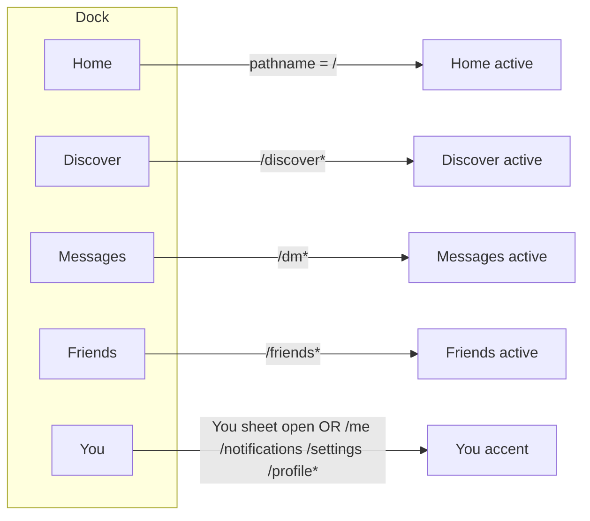
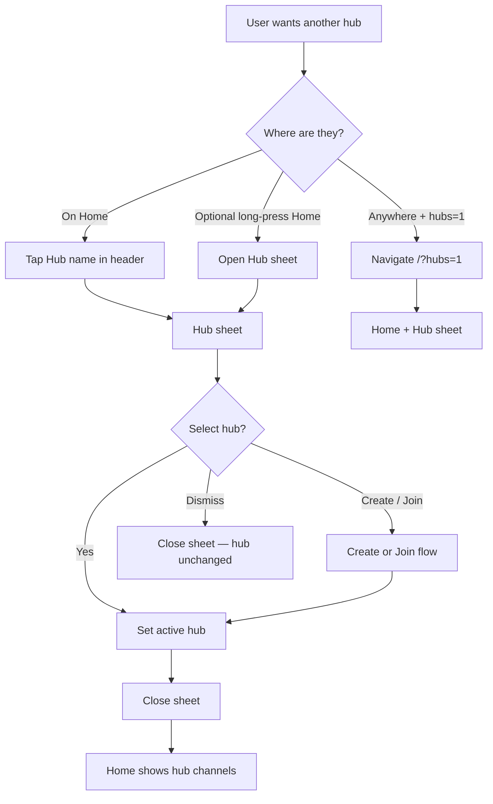
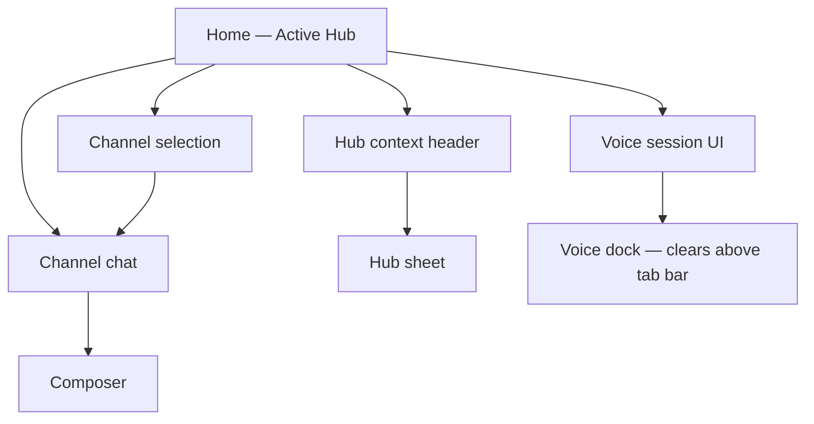
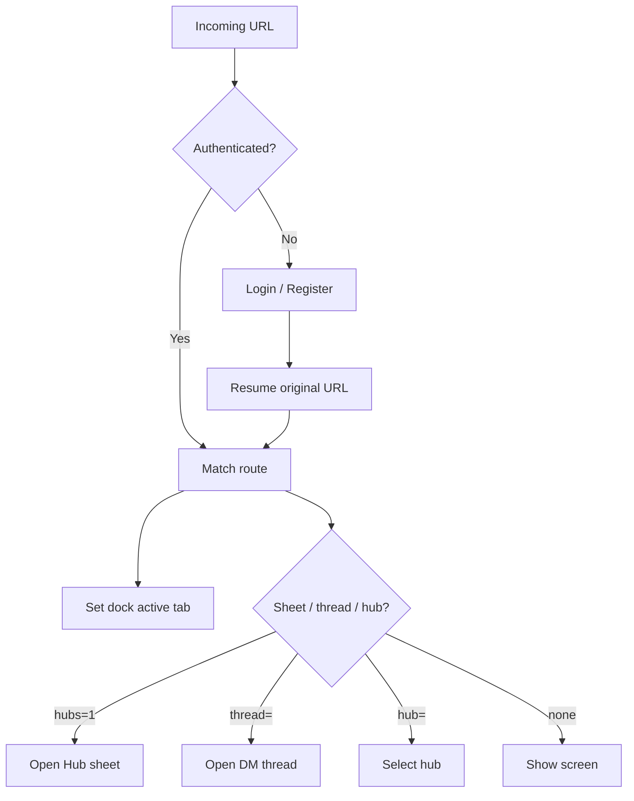
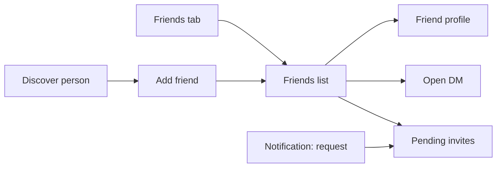
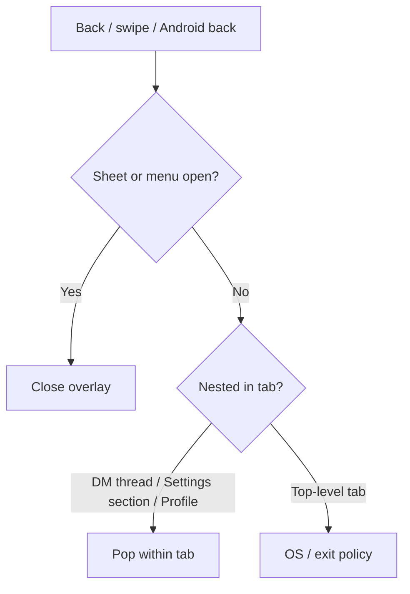
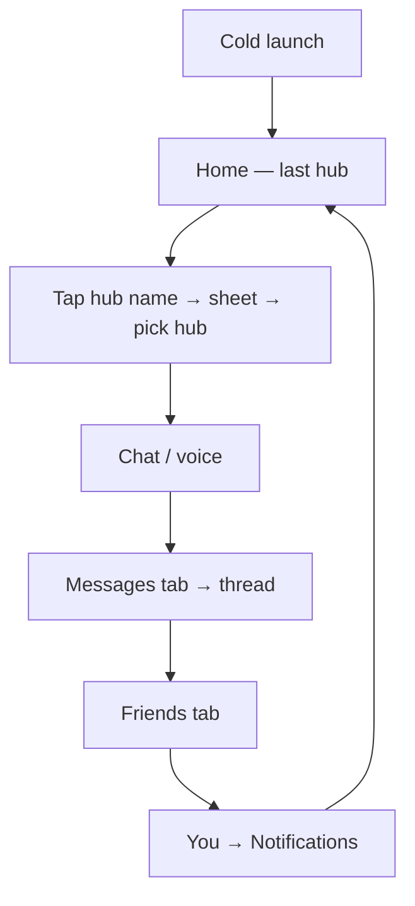
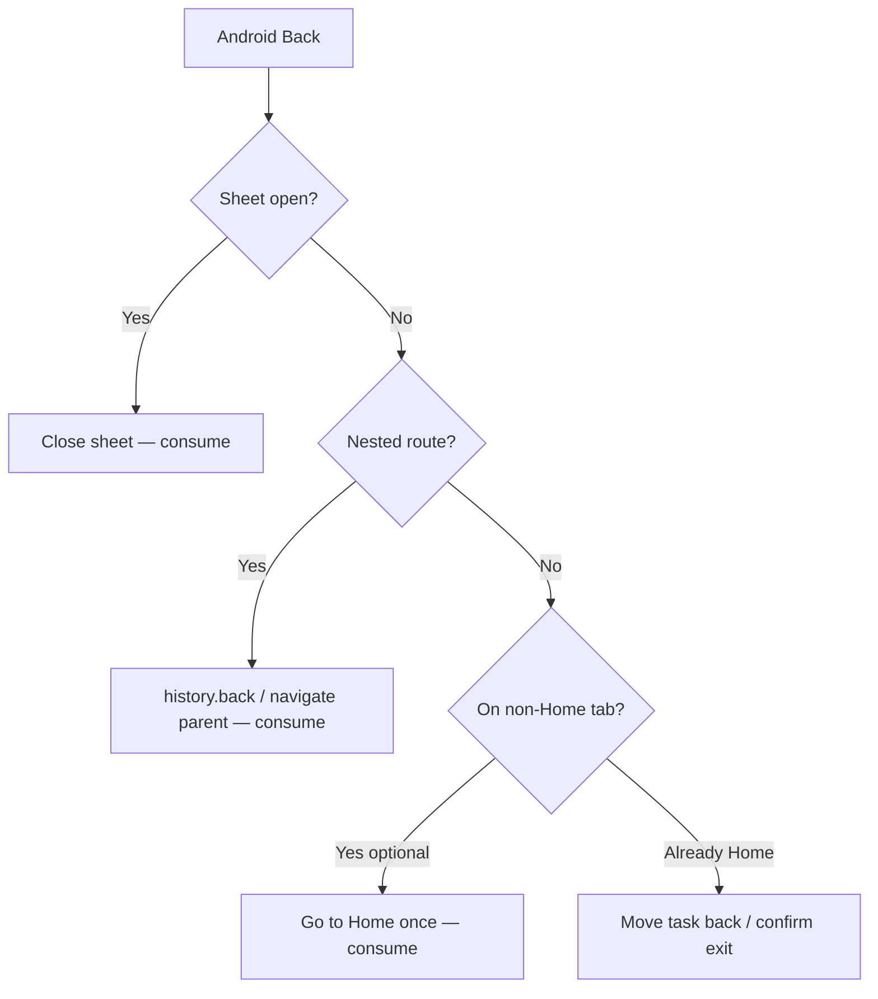

# Nexus — Navigation Architecture Spec

**Status:** Proposal — awaiting approval before any code changes  
**Authority:** Aligns with `design.md` (Navigation) and `docs/UI-IMPLEMENTATION-PLAN.md` Phase A  
**Scope:** Information architecture + flows only. Visual redesign of dock chrome is Phase A/B after approval.  
**Do not implement until this document is approved.**

---

## 0. Goals & non-goals

### Goals
- One obvious primary navigation surface (bottom dock).
- Brand/logo never ambiguous as a destination.
- Hub switching is a first-class, named action — not “tap the logo and hope.”
- Friends, notifications, and settings remain reachable without burying social habits.
- Deep links land in the correct surface with predictable back behavior.
- One-handed use works on typical phone sizes (thumb zone first).
- Arabic RTL and English LTR share the same mental model (logical start/end).

### Non-goals (this doc)
- Visual tokens, type scale, sheet chrome (Phase B).
- Discover content redesign (Phase D).
- Chat/composer redesign (Phase E).
- Changing route URLs unless noted as optional migration.

---

## 1. Current state (baseline)

Today’s dock (`BottomDock`):

| Slot | Control | Behavior |
|------|---------|----------|
| 1 | Home | `/` — active hub chat |
| 2 | Discover | `/discover` |
| 3 | **Logo button** | Opens hub sheet (`onBrandClick` on Home, else `/?hubs=1`) |
| 4 | Messages | `/dm` |
| 5 | You | Overflow sheet → Profile, Friends, Notifications, Settings, Logout |

**Problems vs `design.md`:**
- Logo is the hub switcher — purpose is not obvious.
- Friends / Notifications require a second tap (You → item).
- Five “primary” concepts compete; center brand steals attention without labeling the job.

---

## 2. Proposed final bottom navigation

### 2.1 Tab model (recommended)

**Five primary tabs — no logo as a tab:**

```
┌──────────┬──────────┬──────────┬──────────┬──────────┐
│  Home    │ Discover │ Messages │ Friends  │   You    │
│  (Hub)   │          │   (DM)   │          │          │
└──────────┴──────────┴──────────┴──────────┴──────────┘
```

| Tab | Route root | Job | Badge |
|-----|------------|-----|-------|
| **Home** | `/` | Active hub: channels + text/voice | Channel unread (in active hub / aggregated per product rule) |
| **Discover** | `/discover` | Find games, hubs, people | None (or soft “new” later — not Phase A) |
| **Messages** | `/dm` | Private DMs | DM unread |
| **Friends** | `/friends` | Social graph, presence, invites | Pending friend requests (optional) |
| **You** | Opens **You sheet** (not a page by itself) | Profile shortcut + Notifications + Settings + Logout | Notification unread dot |

**Hub switching is not a tab.** It is a **named control on Home** (and optionally long-press Home — see §3).

### 2.2 Why not keep the center logo?

| Option | Verdict |
|--------|---------|
| Keep logo as hub switcher | Rejects `design.md`: branding must not reduce usability |
| Logo as 6th “tab” | Overcrowds thumb zone; still ambiguous |
| **Named “Hubs” control on Home** | Clear; brand can appear in sheet header / empty states |

### 2.3 Alternative considered (not recommended)

**Home · Discover · Messages · You** (Friends inside You)

- Fewer tabs, but Friends stays buried — weak for a social/gaming product.
- Only accept if product explicitly prioritizes dock minimalism over friend access.

### 2.4 Dock diagram (logical order)

LTR (EN):

```
[ Home ] [ Discover ] [ Messages ] [ Friends ] [ You ]
```

RTL (AR) — **same semantic order via CSS logical layout** (start → end). Visually mirrored:

```
[ You ] [ Friends ] [ Messages ] [ Discover ] [ Home ]
  ↑ start of reading direction may place Home at the “start” edge depending on flex direction —
  implement with `flex` + document order Home→…→You so RTL mirrors correctly.
```

**Rule:** Source order is always Home → Discover → Messages → Friends → You. RTL mirroring is CSS, not reordered JSX.

### 2.5 Active states



**You accent when:** You sheet open, or pathname is `/me`, `/notifications`, `/settings`, `/profile/*` (same “account cluster” as today).

---

## 3. Hub switching flow

### 3.1 Primary entry (required)

On **Home** only, in the **screen header** (not the dock):

```
┌─────────────────────────────────────┐
│  [Hub name ▾]          [Members] …  │  ← tap Hub name / chevron
│  #channel · voice strip             │
│  messages…                          │
└─────────────────────────────────────┘
│ Home | Discover | Messages | Friends | You │
```

- Label: hub display name + chevron (or “Hubs” if none selected).
- Opens **Hub sheet** (existing `Sheet` pattern).
- Selecting a hub: updates active hub → closes sheet → stays on Home.
- Create / join CTAs live inside the sheet (secondary).

### 3.2 Secondary entries

| Entry | Behavior |
|-------|----------|
| Deep link `/?hubs=1` | Land on Home, open Hub sheet once, then clear `hubs` from URL (existing pattern) |
| Deep link `/?hub=<id>` | Select hub if allowed, stay on Home |
| Long-press **Home** tab (optional Phase A+) | Open Hub sheet from any tab without leaving current route first — then navigate to `/` if needed |
| Discover “Open hub” / Join success | Navigate to `/` with hub selected; do **not** auto-open sheet |

### 3.3 Flow diagram



### 3.4 Hub sheet contents (IA only)

1. Current hub (check)
2. Joined hubs list (search if many)
3. Recent hubs (optional)
4. Primary CTA: Create hub
5. Secondary: Join with invite / Discover hubs → `/discover`

---

## 4. Home hierarchy

Home is **not** a dashboard. It is the **active hub workspace**.

```
Home (/)
├── Hub context (header: hub switcher)
├── Channel / room list OR channel picker
├── Active channel transcript
├── Composer (+ attach / emoji as today)
├── Voice participants / controls (when in voice)
└── Contextual sheets
    ├── Hub sheet (switch / create / join)
    ├── Members
    ├── Pins / channel info
    └── Voice settings (local)
```

### 4.1 Hierarchy diagram



### 4.2 What Home is not
- Not Discover
- Not DM inbox
- Not Friends list
- Not Settings

Leaving Home for those destinations uses the dock (one tap).

---

## 5. Deep-link behavior

### 5.1 Principles
1. Deep link opens the **target surface**, not a parent then hope.
2. Dock reflects the destination’s tab.
3. Back / gesture returns to a sensible previous app surface (see §9), not always browser history chaos.
4. Auth gate: unauthenticated → login → resume intended URL after session.

### 5.2 Map

| Deep link | Lands on | Dock active | Extra |
|-----------|----------|-------------|-------|
| `/` | Home | Home | — |
| `/?hub=<id>` | Home, hub selected | Home | Invalid hub → toast + hub sheet or Discover CTA |
| `/?hubs=1` | Home + Hub sheet | Home | Clear `hubs` after open |
| `/discover` | Discover | Discover | — |
| `/discover?…` | Discover with filters (Phase D) | Discover | Preserve query |
| `/dm` | DM list | Messages | — |
| `/dm?thread=<id>` | DM thread | Messages | Missing thread → list + toast |
| `/friends` | Friends | Friends | — |
| `/notifications` | Notifications | You (accent) | — |
| `/settings` | Settings root | You (accent) | — |
| `/settings#section` or `?section=` | Settings section | You | Prefer query over hash for Cap |
| `/me` | Own profile | You (accent) | — |
| `/profile/:id` | Profile | You or none* | *If opened from Friends/Discover, keep source tab accent if possible; else You |
| `/hub/:slug` (if exists) | Resolve → Home with hub | Home | Redirect preferred over duplicate IA |
| Invite / join URLs | Join flow → Home | Home | On success |

### 5.3 Deep-link flow



### 5.4 Push notification taps
Treat as deep links to the entity URL (DM thread, channel if encoded, notifications list fallback).

---

## 6. Friend access

### 6.1 Primary
- **Friends tab** on the dock → `/friends` (one tap).

### 6.2 Secondary
- Profile → Friends (optional shortcut)
- Discover people → Add friend → may deep-link back to Friends or stay in Discover
- Notifications: “Friend request” → Friends or request detail

### 6.3 Flow



---

## 7. Notification access

### 7.1 Primary
- **You tab** → **Notifications** row → `/notifications`  
  Badge/dot on You when `unreadCount > 0`.

### 7.2 Why not a 6th dock tab?
- Notifications are an **inbox of events**, not a daily “place” like Home/Discover/Messages/Friends.
- Badge on You is enough if the path is two taps max.

### 7.3 Optional enhancement (approve separately)
- Tap You with unread → land directly on Notifications (skip sheet) when unread > 0; long-press You always opens sheet.  
  **Default proposal:** always open You sheet (predictable). Direct-to-notifications is opt-in later.

### 7.4 Flow

```mermaid
flowchart TD
  You[Tap You] --> Sheet[You sheet]
  Sheet --> N[/notifications]
  Sheet --> S[/settings]
  Sheet --> Me[/me]
  Sheet --> Out[Logout]
  Push[Push tap] --> Entity[Entity deep link]
  Entity -.-> N
```

---

## 8. Settings access

### 8.1 Primary
- You sheet → Settings → `/settings`

### 8.2 Secondary
- Account rows that say “Open in Settings” → `/settings?section=…`
- No Settings icon on the primary dock (keeps dock for daily destinations)

### 8.3 In-settings navigation
- List of sections (Account, Privacy, Appearance, Voice, Notifications, Language, …)
- Back within Settings returns to section list, then to previous app surface (usually You sheet closed → prior tab)

### 8.4 Flow

```mermaid
flowchart TD
  You[You sheet] --> Settings[/settings]
  Settings --> Sec[Section detail]
  Sec --> Back1[Back to section list]
  Back1 --> Back2[Back / gesture → leave Settings]
  Deep[/? or link section=voice] --> Sec
```

---

## 9. Back navigation

### 9.1 Layers (innermost first)

```
1. Transient UI: menus, emoji, tooltips → dismiss
2. Modal / sheet (Hub, You, Members, Filter) → close sheet; route unchanged
3. Nested screen (Settings section, DM thread, Profile) → pop to parent in same tab
4. Cross-tab → do not “back” into another tab’s history by default on mobile;
   system back on Android may still pop router history — see §11
```

### 9.2 Proposed rules

| Context | Back / Close does |
|---------|-------------------|
| Any sheet open | Close sheet only |
| You sheet open | Close sheet |
| DM thread open | Return to DM list (`/dm` clear `thread`) |
| Settings section | Return to Settings root |
| Profile from Friends | Return to Friends |
| Profile from Discover | Return to Discover |
| Hub sheet | Close; stay on Home |
| Top-level tab screen | Android: exit confirm or minimize (OS); iOS: no system back button |

### 9.3 Diagram



### 9.4 Browser history
Web: prefer `replace: true` when selecting DM threads / hubs so Back doesn’t thrash through every channel. Exact replace policy can be Phase A detail — default: **hub switches replace; DM thread push then replace after settle**.

---

## 10. iPhone navigation flow

### 10.1 Chrome
- Bottom dock + home indicator safe area (`pb-safe`, `--dock-clearance`).
- No Android-style nav bar; **gesture back** (edge swipe) where WKWebView / Cap allows.
- Hub / You / Members = bottom sheets above dock clearance (existing Sheet pattern).

### 10.2 Typical session



### 10.3 Gestures
| Gesture | Expected |
|---------|----------|
| Edge swipe back | Close sheet or pop nested route |
| Swipe down on sheet | Dismiss sheet (Phase B polish if missing) |
| Pull to refresh | Where lists support it (Friends, Notifications, Discover) — not chat transcript by default |

### 10.4 Voice
Voice dock / controls must clear **above** the tab bar; never cover Home Indicator + dock.

---

## 11. Android navigation flow

### 11.1 Chrome
- Same bottom dock (Capacitor / web).
- **System Back** must map to §9 layers (predictable).
- Gesture navigation (3-button vs gesture) both invoke the same back handler.

### 11.2 Back handler priority



**Proposal default:**  
1) Close overlay → 2) Pop nested → 3) If not Home, go Home → 4) Else exit app.  

(Step 3 is common in chat apps; approve or reject explicitly.)

### 11.3 Deep links / intents
Same URL map as §5; Android App Links should resolve to Cap WebView routes identically.

---

## 12. One-handed usage analysis

### 12.1 Thumb zone (portrait, right hand)

```
        ┌─────────────────────┐
        │   HARD REACH        │  ← Hub name, members, top actions
        │                     │
        │   COMFORTABLE       │  ← Mid chat / lists
        │                     │
        │   EASY (thumb)      │  ← Dock + bottom sheets
        └─────────────────────┘
              ● dock center
```

### 12.2 Implications

| Action | Frequency | Placement | One-hand score |
|--------|-----------|-----------|----------------|
| Switch tab | Very high | Dock | Excellent |
| Send message | Very high | Composer above dock | Excellent |
| Switch hub | High | Home header (top) | Fair — mitigate with optional long-press Home |
| Open Friends | High | Dock tab | Excellent (vs today’s You→Friends) |
| Notifications | Medium | You → list | Good (2 taps) |
| Settings | Low | You → Settings | Acceptable |
| Discover filters | Medium | Bottom sheet (Phase D) | Excellent |

### 12.3 Mitigations in this proposal
1. **Friends on dock** — removes buried social path.  
2. **Named hub control** — clearer than logo, even if still top-placed.  
3. **Optional long-press Home → Hub sheet** — puts hub switch in thumb zone.  
4. **Sheets from bottom** — filters, hubs, You menu stay in easy zone.  
5. **No 6th center logo** — avoids awkward stretch to a non-labeled center control.

### 12.4 Left-handed / RTL
- Logical properties for padding and badges (`-start` / `-end`).
- Dock source order unchanged; mirroring keeps Home toward the “start” side in RTL so primary gaming surface stays natural for AR users.

### 12.5 Risk: five tabs
Five tabs are denser than four. Acceptable if:
- Labels stay short (Home / Discover / Messages / Friends / You — localized).
- Touch targets ≥ 44×44 pt.
- Badges don’t obscure icons.

If density fails usability testing, fall back to Alternative §2.3 (Friends inside You) — document as Plan B.

---

## 13. Master path diagrams

### 13.1 All primary destinations

```mermaid
flowchart TB
  Dock[Bottom Dock]

  Dock --> Home[/]
  Dock --> Discover[/discover]
  Dock --> Messages[/dm]
  Dock --> Friends[/friends]
  Dock --> YouSheet[You sheet]

  Home --> HubSheet[Hub sheet]
  Home --> Channel[Channel chat]
  Messages --> Thread[DM thread]
  Friends --> FProfile[Friend profile]
  YouSheet --> Me[/me]
  YouSheet --> Notif[/notifications]
  YouSheet --> Settings[/settings]
  YouSheet --> Logout[Logout → /login]
```

### 13.2 Cross-feature journey (play → social → settings)

```
Home (hub chat)
  → Discover (find hub) → join → Home
  → Messages (coordinate) → thread → back to list
  → Friends (add teammate) → profile → DM
  → You → Notifications (invite) → Friends
  → You → Settings (mic) → back → Home
```

---

## 14. Migration from current dock

| Today | Proposed |
|-------|----------|
| Home | Home (unchanged role) |
| Discover | Discover |
| **Logo → hubs** | **Remove from dock**; Hub name on Home + `?hubs=1` |
| Messages | Messages |
| You → Friends | **Friends tab** |
| You → Notifications / Settings / Profile / Logout | **Unchanged** inside You sheet |

**URL stability:** Keep `/`, `/discover`, `/dm`, `/friends`, `/notifications`, `/settings`, `/me`. No forced renames in Phase A.

---

## 15. Approval checklist

Approve or amend before Phase A code:

- [ ] **Tab model:** Home · Discover · Messages · Friends · You (recommended)
- [ ] **Plan B:** Friends stays under You (only if rejecting Friends tab)
- [ ] **Hub switch:** Header control on Home (required)
- [ ] **Long-press Home → hubs:** Yes / No / Later
- [ ] **You + unread:** Always open sheet (default) vs jump to Notifications
- [ ] **Android back:** Overlay → nested → Home → exit (default) vs Overlay → nested → exit
- [ ] **Deep links:** Table in §5 accepted
- [ ] **No code** until this file is marked **Approved** below

---

## 16. Approval

| Field | Value |
|-------|--------|
| Status | **Approved** (frozen with planning set; Phase A implemented — see `docs/UI-PHASE-A.md`) |
| Approved by | Product (planning complete) |
| Date | 2026-07-16 |
| Notes / amendments | Long-press Home and Android back policy deferred; You always opens sheet |
)
